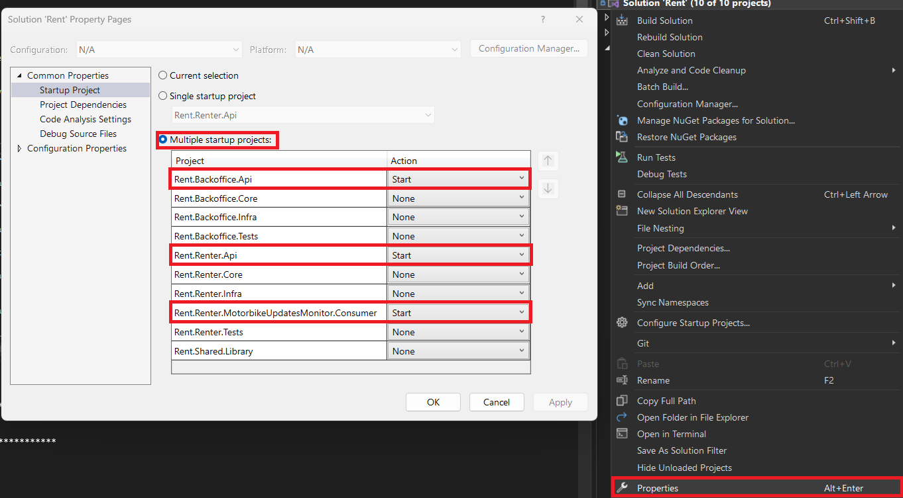
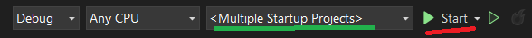
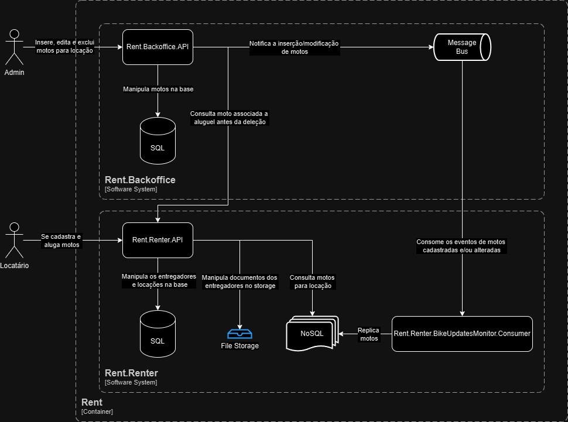
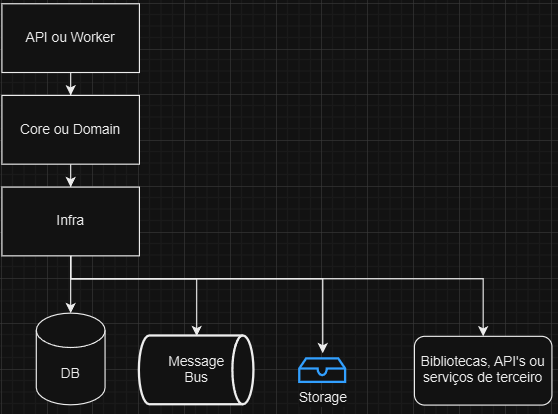

# RentSystem
Uma aplicação de locação de motos

## 🚀 Começando
Essas instruções permitirão que você obtenha uma cópia do projeto em operação na sua máquina local para fins de desenvolvimento e teste.

### 📋 Pré-requisitos
* [Docker & Docker Compose](https://docs.docker.com/get-docker/)
* [Visual Studio](https://visualstudio.microsoft.com/pt-br/launch/)
* [.NET 8](https://dotnet.microsoft.com/download/dotnet/8.0) ou superior
* [Git](https://git-scm.com/downloads)

### 🔧 Clonando e Compilando
Abra um terminal e clone este repositório em qualquer diretório da sua máquina utilizando o comando:
```
git clone https://github.com/herculesdev/rent.git
```

Acesse a pasta com:
```
cd rent
```
Restaure as dependências:
```
dotnet restore
```

Compile utilizando:
```
dotnet build
```

Rode os testes de unidade (caso queira):
```
dotnet test
```
### 🐋 Infra com Docker (Rabbit, Postgres e Mongo)
Abra o terminal, acesse o pasta raiz do repositório que clonou na etapa anterior e execute o seguinte comando

```
docker compose up -d
```
**OBS 1:** use `docker compose down` para encerrar os serviços de infra.

**OBS 2:** os containers não guardam dados, sempre que reiniciados iniciam-se do zero

### 💻 Rodando os multiplos projetos
Abra 3 instâncias de um terminal (abas ou janelas) e em cada um deles, entre na pasta raiz do projeto (repositório que você clonou na etapa anterior)

#### 1. Rent.Backoffice.Api
```
dotnet run --project Rent.Backoffice.Api
```
Resultado
```
[INF] Now listening on: "http://localhost:5140"
[INF] Application started. Press Ctrl+C to shut down.
[INF] Hosting environment: "Development"
```

Após isto, a API **Rent.Backoffice.Api** estará em funcionamento. Acesse http://localhost:5140/swagger para visualizar a documentação dos endpoints


#### 2. Rent.Renter.Api
```
dotnet run --project Rent.Renter.Api
```
Resultado
```
[INF] Now listening on: "http://localhost:5007"
[INF] Application started. Press Ctrl+C to shut down.
[INF] Hosting environment: "Development"
```

Após isto, a API **Rent.Renter.Api** estará em funcionamento. Acesse http://localhost:5007/swagger para visualizar a documentação dos endpoints

#### 3. Rent.Renter.MotorbikeUpdatesMonitor.Consumer
```
dotnet run --project Rent.Renter.MotorbikeUpdatesMonitor.Consumer
```
Resultado
```
[INF] Application started. Press Ctrl+C to shut down.
[INF] Hosting environment: "Development"
[INF] Content root path: "..."
[INF] Worker started at: 08/05/2024 23:06:27 +00:00 (UTC)
```

Após isto, o worker **Rent.Renter.MotorbikeUpdatesMonitor.Consumer** estará em funcionamento. Pronto para replicar as motos do contexto de **Backoffice** para o contexto **Rent**

**OBSERVAÇÃO:** Se preferir usar o **Visual Studio** para rodar o projeto, vá nas propriedades da solução e configure para executar as três aplicações ao mesmo tempo, conforme imagem a seguir



Em seguida execute a aplicação. Você perceberá alguns consoles e navegadores abrindo




## 📚 Arquitetura
A arquitetura foi dividida em dois contextos, Backoffice (onde os administradores conseguem cadastrar motos) e Renter (onde os entregadores conseguem alugá-las).

- O contexto de **Backoffice** possui apenas uma API simples com operações crud para motos.
- O contexto **Renter** possui uma aplicação do tipo "Worker" que consome eventos emitidos pelo **Backoffice.Api** e replica os dados no MongoDB, além de possuir uma API que permite o cadsatro de entregadores e o aluguel das motos
- Essa decisão de design foi adotada para as aplicações de backoffice e de aluguel possam crescer e escalar separadamente, podendo inclusive evoluir para um cenário de microsserviços



## 📚 Arquitetura interna do projeto
A arquitetura interna adotada busca aumentar a coesão e reduzir as indireções, apesar disso tenta também manter certo nível de desacoplamento, já que um reduz o outro (coesão reduz desacoplamento e desacoplamento reduz coesão). Segue algumas observações importantes:
- Evitei abstrações desnecessárias, principalmente para bibliotecas que hoje são padrões no desenvolvimento .NET
- Conforme a síntese acima, tentei reduzir as indireções evitando excesso de camadas, mas se fosse necessário, poderia ter N camadadas (Anticorruption, Application, CrossCuting e etc..)
- A camada de domain é o centro, as dependências são invertidas e tudo depende dela, não o contrário.

**ATENÇÃO**: As setas no diagrama abaixo não indica dependência entre as camadas, mas sim o fluxo natural da informação ou de ordem de acionamento dos serviços.



## 🛠️ Construído com
Ferramentas/tecnologias utilizadas para construção deste projeto

* [.NET 8](https://dotnet.microsoft.com/download/dotnet/8.0) - Backend
* [Entity Framework Core](https://docs.microsoft.com/pt-br/ef/core/) - Mapeamento Objeto-Relacional
* [Fluent Validation](https://github.com/FluentValidation/FluentValidation) - Validações de domínio
* [NSubstitute](https://github.com/nsubstitute/NSubstitute) - Mockagem de dependencias nos testes de unidade
* [Serilog](https://serilog.net/) -  Log estruturado
* [Visual Studio Code](https://code.visualstudio.com/) - Editor de Código
* [Visual Studio 2022](https://visualstudio.microsoft.com/pt-br/launch/) - IDE C# / .NET
* [Swagger](https://swagger.io/) - Documentação e teste da API
* [RabbitMQ](https://www.rabbitmq.com/) - Mensageria
* [MongoDB](https://www.mongodb.com/) - Banco de dados não relacional
* [PostgreSQL](https://www.postgresql.org/) - Banco de dados relacional